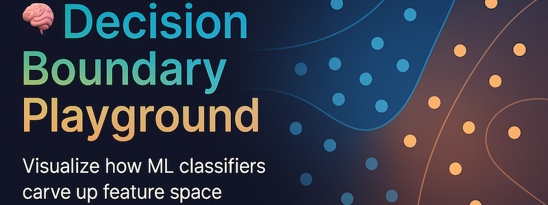

<p align="center">
  
</p>

# 🧠 Decision Boundary Playground  
**Interactive ML Explainer • Streamlit + scikit-learn**

<p align="center">
  
</p>

[](https://decision-boundary-playground.streamlit.app/)
[](https://www.python.org/)
[](https://scikit-learn.org/stable/)
[](https://plotly.com/python/)
[](LICENSE)

---

## 🌍 Live Demo  
🔗 **[Launch the App →](https://decision-boundary-playground.streamlit.app/)**

---

## 🧩 What it Does
An interactive sandbox to visualize how different **classification models** carve up 2‑D feature space.  
You can:
- Generate synthetic datasets (`blobs`, `moons`, `circles`, `XOR`)
- Explore real datasets (**Iris**, **Titanic**, **Breast Cancer**, **Penguins**, **Wine**)
- Adjust **noise**, **class imbalance**, and **polynomial features**
- Train models: **Logistic Regression**, **SVM**, **KNN**, **Random Forest** (+ **XGBoost** optional)
- See **decision boundaries** update in real time
- Inspect **metrics**, **ROC curve** (binary), and **model comparison**

---

## 🧠 Available Datasets
| Type | Dataset | Description |
|------|--------|-------------|
| Synthetic | Blobs, Moons, Circles, XOR | Visualize linear vs curved decision shapes |
| Real-world | Iris, Titanic, Breast Cancer, Penguins, Wine | Classic ML sets with 2‑D views |
| Custom | Upload CSV | Pick any 2 feature columns + target and visualize instantly |

💡 **Try this:**  
- `XOR` + `Logistic Regression` + **Polynomial degree 3** → non‑linear magic ✨  
- `Moons` + `SVM (RBF)` + **low noise** → smooth curvy boundary  
- `Blobs` + `Random Forest` → stable partitions  
- `Titanic` + `Random Forest` → watch precision/recall under imbalance  
- `Iris` + `Logistic Regression` → textbook multi‑class separation  
- `Penguins` + `KNN (k=7)` → distinct species clusters  

---

## 🚀 Quickstart

```bash
python -m venv .venv && source .venv/bin/activate   # .venv\Scripts\activate on Windows
pip install -r requirements.txt
streamlit run app.py
```

### Docker
```bash
docker build -t decision-boundary-playground .
docker run -p 8501:8501 decision-boundary-playground
```

---

## 📸 Gallery
(Insert `demo.gif` once recorded for the live app.)

---

## 📄 License
MIT © YOUR NAME
